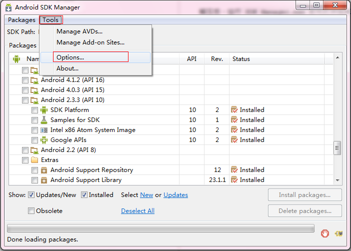
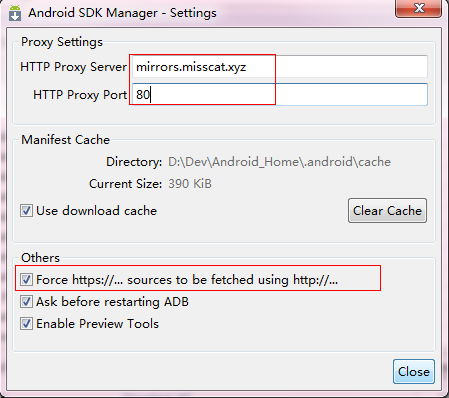
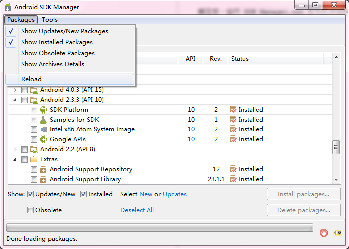

##Android镜像

*注：*使用前请先确认防火墙是否能访问到镜像服务器。

###Android Tools

####Android SDK内网在线更新镜像服务器

`mirrors.misscat.xyz` 端口:`80`

####下载SDK

访问下载最新的Windows SDK：

[点击下载](http://mirrors.misscat.xyz/android/android-sdk_r24.4.1-windows.zip)

解压后，运行`SDK Manager.exe`即可打开SDK管理器。

####配置更新

使用方法：

1. 启动 Android SDK Manager ，打开主界面，依次选择`Tools`、`Options...`，弹出`Android SDK Manager - Settings`窗口；

    

2. 在`Android SDK Manager - Settings`窗口中，在`HTTP Proxy Server`和`HTTP Proxy Port`输入框内填入镜像服务器地址(不包含`http://`，如下图)和端口，并且选中`Force https://... sources to be fetched using http://...`复选框。设置完成后单击`Close`按钮关闭`Android SDK Manager - Settings`窗口返回到主界面；

    

3. 依次选择`Packages`、`Reload`。

    

####Android Studio

| 版本        	| 平台  	  |  下载	 | 大小	 | SHA-1校验码	 |
| :----:   	| :----:  | :----:  | :----: | :----: |
| 2.0 Beta5       | Windows |[下载](http://mirrors.misscat.xyz/dl/android/studio/ide-zips/2.0.0.14/android-studio-ide-143.2609919-windows.zip)| 329145128 | 5C2529DE1D0B48EF67F286D54FCB2292726FAA6E |
| 2.0 Beta5       | Linux |[下载](http://mirrors.misscat.xyz/dl/android/studio/ide-zips/2.0.0.14/android-studio-ide-143.2609919-linux.zip)| 326661595 | F52A50286C10209B8A5D5F86464D850F761884AA |
| 2.0 Beta5       | Mac |[下载](http://mirrors.misscat.xyz/dl/android/studio/ide-zips/2.0.0.14/android-studio-ide-143.2609919-mac.zip)| 327595324 | F3BF3BCA5E02CCD9A7986D53543608401816ADE3 |
| 1.5.1.0       | Windows |[下载bundle](http://mirrors.misscat.xyz/dl/android/studio/install/1.5.1.0/android-studio-bundle-141.2456560-windows.exe)| 1209163328 | 6FFE608B1DD39041A578019EB3FEDB5EE62BA545 |
| 1.5.1.0       | Windows |[下载zip](http://mirrors.misscat.xyz/dl/android/studio/ide-zips/1.5.1.0/android-studio-ide-141.2456560-windows.zip)| 375635150 | 64882FB967F960F2142DE239200104CDC9B4C75B |
| 1.5.1.0       | Windows |[下载exe](http://mirrors.misscat.xyz/dl/android/studio/install/1.5.1.0/android-studio-ide-141.2456560-windows.exe)| 351419656 | 8D016B90BF04EBAC6CE548B1976B0C8A4F46B5F9 |
| 1.5.1.0       | Linux |[下载](http://mirrors.misscat.xyz/dl/android/studio/ide-zips/1.5.1.0/android-studio-ide-141.2456560-linux.zip)| 380943097 | B8460A2197ABE26979D88E3B01B3C8BFD80A37DB |
| 1.5.1.0       | Mac |[下载](http://mirrors.misscat.xyz/dl/android/studio/install/1.5.1.0/android-studio-ide-141.2456560-mac.dmg)| 367456698 | D0807423985757195AD5AE4717D580DEEBA1DBD8 |

####SDK Tools

| 版本        	| 平台  	  |  下载 	 | 大小	 | SHA-1校验码	 |
| :----:   	| :----:  | :----:  | :----: | :----: |
| 24.4.1       | Windows |[下载](http://mirrors.misscat.xyz/android/repository/android-sdk_r24.4.1-windows.zip)| 199701062 | 64882FB967F960F2142DE239200104CDC9B4C75B |
| 24.4.1       | Linux |[下载](http://mirrors.misscat.xyz/android/android-sdk_r24.4.1-linux.tgz)| 326412652 | 725BB360F0F7D04EACCFF5A2D57ABDD49061326D |
| 24.4.1       | Mac |[下载](http://mirrors.misscat.xyz/android/repository/android-sdk_r24.4.1-macosx.zip)| 102781947 | 85A9CCCB0B1F9E6F1F616335C5F07107553840CD |

<!--####Git

| 版本号 | Windows |
| :----: | :----: |
| 2.7.1.2 | [32bit](git/PortableGit-2.7.1.2-32-bit.7z.exe) |
| 2.7.1.2 | [64bit](git/PortableGit-2.7.1.2-64-bit.7z.exe) |-->

####Gradle

| 版本号 | 下载 | 大小 | SHA-1校验码 |
| :----: | :----: | :----: | :----: |
| 2.11 | [下载](http://mirrors.misscat.xyz/gradle/gradle-2.11-all.zip) |69319677|A94A2FE4E9F112CFF6A96FEADEB138E945D33C4F|
| 2.11 | [下载](http://mirrors.misscat.xyz/gradle/gradle-2.10-all.zip) |68425872|A144CA0DD8E6EBEFDC85DF41DE3DFDFE5C38CCB4|
| 2.9 | [下载](http://mirrors.misscat.xyz/gradle/gradle-2.9-all.zip) |66616757|FF0B2E6802C0B246C96BDA1409D37EDB8AD5933F|
| 2.8 | [下载](http://mirrors.misscat.xyz/gradle/gradle-2.8-all.zip) |66378720|FC159D44CA60D068BCEDDC7C5C153DB3016EF527|
| 2.7 | [下载](http://mirrors.misscat.xyz/gradle/gradle-2.7-all.zip) |65866593|A28AC5CD0DFB4BBE1DEC5AD28A1D20ACC1F348FA|
| 2.6 | [下载](http://mirrors.misscat.xyz/gradle/gradle-2.6-all.zip) |65594074|139EDF316650D90DFCF7A2FD44A433556A0D06D0|
| 2.5 | [下载](http://mirrors.misscat.xyz/gradle/gradle-2.5-all.zip) |65027659|F3C307A91D14B4D30973E61B59BDD80E19093F33|
| 2.4 | [下载](http://mirrors.misscat.xyz/gradle/gradle-2.4-all.zip) |65433094|0772B2C8B47CB1ACC3A33CDA4DF165B944258164|
| 2.3 | [下载](http://mirrors.misscat.xyz/gradle/gradle-2.3-all.zip) |60081333|DFFCF9D8753F7ABCC09B6A19B2EDDAF853BC6EF8|
| 2.2.1 | [下载](http://mirrors.misscat.xyz/gradle/gradle-2.2.1-all.zip) |58602849|CAA0E8F1BCD4932540DA2D218CC2EF64E29A8531|
| 2.2 | [下载](http://mirrors.misscat.xyz/gradle/gradle-2.2-all.zip) |58568174|DAD18E305235BAD3E869F0B79194FFE7800286CB|
| 2.1 | [下载](http://mirrors.misscat.xyz/gradle/gradle-2.1-all.zip) |57777618|C8F7C04E0DFBC4ABAD5BB1D09E0EFD93FE3128D9|
| 2.0 | [下载](http://mirrors.misscat.xyz/gradle/gradle-2.0-all.zip) |56973278|7FBDB0DCF03B58644D1E97C1F053399B2E5A2EA5|

###ADT Plugin
| 版本号 | 下载 | 大小 | SHA-1校验码 |
| :----: | :----: | :----: | :----: |
| 23.0.7 | [下载](http://mirrors.misscat.xyz/adt/ADT-23.0.7.zip) |103355791|3722429C2ADFE9DC6D3DCA89F6AA745835100023|
| 23.0.6 | [下载](http://mirrors.misscat.xyz/adt/ADT-23.0.6.zip) |103344298|1CE14CF4F6E3BF8E4213DD22CFD14C2237C8C22D|
| 23.0.4 | [下载](http://mirrors.misscat.xyz/adt/ADT-23.0.4.zip) |103351808|D9ABB391CDE0FCB431D9735CAE72FDEAC85AB123|
| 23.0.3 | [下载](http://mirrors.misscat.xyz/adt/ADT-23.0.3.zip) |103321934|D33F9595C718942D2DEBAFF20B0B1F339025F49F|
| 23.0.2 | [下载](http://mirrors.misscat.xyz/adt/ADT-23.0.2.zip) |103287135|D0387C3A1DD5417B877AD11FAC9FC6D0AFC0D630|

###NDK
| 版本        	| 平台  	  |  下载 	 | 大小	 | SHA-1校验码	 |
| :----:   	| :----:  | :----:  | :----: | :----: |
| r10e       | Windows X86 |[下载](http://mirrors.misscat.xyz/android/ndk/android-ndk-r10e-windows-x86.exe)| 396563176 | EB6BD8FE26F5E6DDB145FEF2602DCE518BF4E7B6 |
| r10e       | Windows X86_64 |[下载](http://mirrors.misscat.xyz/android/ndk/android-ndk-r10e-windows-x86_64.exe)| 419616132 | 6735993DBF94F201E789550718B64212190D617A |
| r10e       | Linux X86 |[下载](http://mirrors.misscat.xyz/android/ndk/android-ndk-r10e-linux-x86.bin)| 394281908 | B970D086D5C91C320C006EA14E58BD1A50E1FE52 |
| r10e       | Linux X86_64 |[下载](http://mirrors.misscat.xyz/android/ndk/android-ndk-r10e-linux-x86_64.bin)| 401522849 | C685E5F106F8DAA9B5449D0A4F21EE8C0AFCB2F6 |
| r10e       | Mac |[下载](http://mirrors.misscat.xyz/android/ndk/android-ndk-r10e-darwin-x86_64.bin)| 388937326 | B57C2B9213251180DCAB794352BFC9A241BF2557 |

